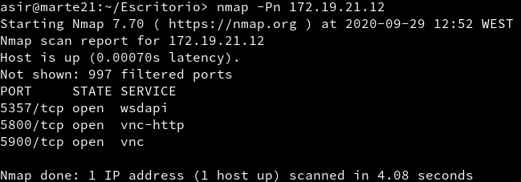
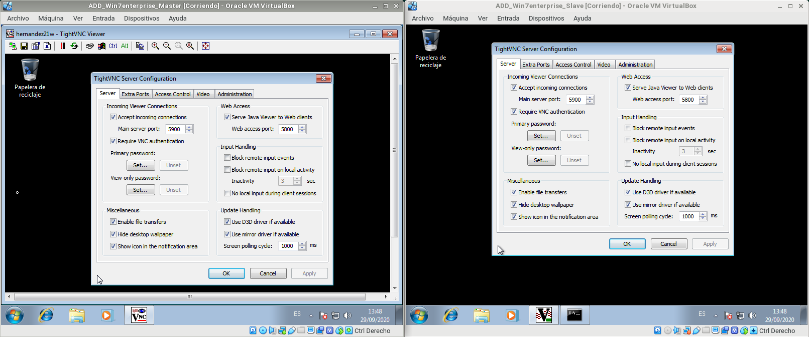

# Práctica 1: Acceso Remoto VNC
___

## 1.Windows: Slave VNC  
  - Crearemos una MV de Windows y la configuraremos. En este caso tendrá la IP  `172.19.21.12`.
  - Descargaremos e instalaremos `TightVNC > Custom > Server`.
  - Permitiremos acceso al cortafuegos.

### 1.2 Comprobación desde una máquina GNU/Linux
  - Ejecutaremos `nmap -Pn 172.19.21.12` desde la máquina real para comprobar que los servicios son visibles desde fuera. Observamos que los puertos 5800 y 5900 son visibles.

___

## 2.Windows: Master VNC
  - Clonaremos la máquina Slave y canbiaremos la IP a `172.19.21.11`.
  - Descargaremos e instalaremos `TightVNC > Custom > Viewer`.

### 2.1 Comprobaciones finales
- Conectar desde Windows Master hacia Windows Slave

- Ir al servidor VNC y usar el comando `netstat -n` para ver las conexiones VNC con el cliente.
