# Práctica 2 - Acceso remoto SSH
## 1.- Preparativos
### 1.1.- Servidor SSH
- Crear una Máquina virutal OpenSUSE sin entorno gráfico, que usaremos como servidor SSH y realizar configuración estándar.
- Añadir en `/etc/hosts` los equipos cliente21g y cliente21w con sus respectivas IPs.
- Comprobaciones:
  - `ip a` donde comprobaremos la IP, la máscara y el nombre de la interfaz.
  
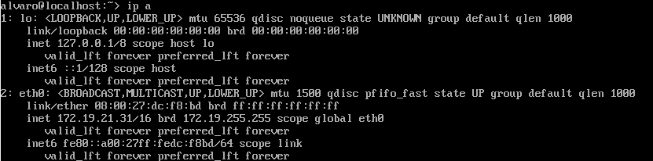
  
  - `ip route` para comprobar la puerta de enlace.
  
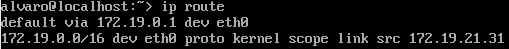

  - `ping 8.8.4.4 -i 2` comprobar conectividad externa.
  
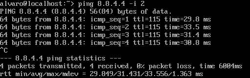

  - `host www.nba.com` comprobar el servidor DNS

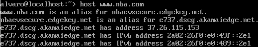

  - `ping cliente21g` comprobar conectividad con el cliente Linux

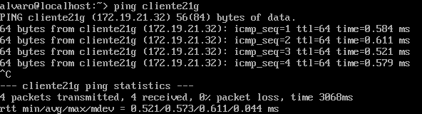

  - `ping cliente21w` comprobar conectividad con el cliente Windows

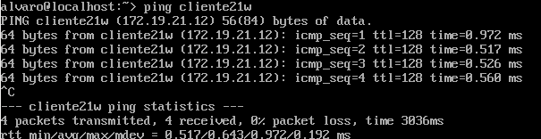

- Crear los siguientes usuarios:

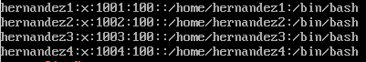

### 1.2.- Cliente GNU/Linux

- Crear una Máquina virtual OpenSUSE con la configuración estándar y nombre de máquina `cliente21g`.
- Añadir en `/etc/hosts` los equipos server21g y cliente21w con sus respectivas IPs.
- Comprobar haciendo ping a ambos.

### 1.3.- Cliente Windows
- Crear una Máquina virtual Windows con la configuración estándar y nombre de máquina `cliente21w`.
- Instalar software PuTTY (cliente de SSH).
- Añadir en `C:\Windows\System32\drivers\etc\hosts` los equipos server21g y cliente21g con sus respectivas IPs.
- Comprobar haciendo ping a ambas máquinas.

---

## 2.- Instalación del servicio SSH en GNU/Linux
- Instalar el servicio SSH en la máquina server21g con `zypper install openssh`.
### 2.1.- Comprobación
- Para comprobar el funcionamiento del servicio ssh ejecutaremos el comando `systemctl status sshd` en la terminal.
- Para comprobar que está escuchando por el puerto 22 ejecutar `sudo lsof -i:22`.

### 2.2.- Primera conexión SSH desde Linux.
- Ir al cliente
- Comprobar conectividad con el servidor con `ping server21g`.
- Comprobar que el puerto 22 está abierto con `nmap -Pn server21g`
- Conectar mediante `ssh hernandez1@server21g`.

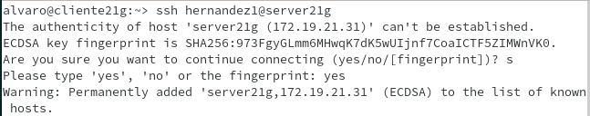

- A partir de ahora solo nos pedirá la contraseña al conectarnos:

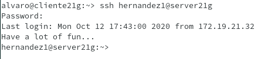

- Comprobar el contenido del fichero `$HOME/.ssh/known_hosts`.

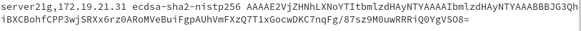

### 2.3.- Primera conexión SSH desde Windows.
- Conectar al servidor usando PuTTY.
- Podemos observar el intercambio de claves que se produce en la primera conexión ssh.

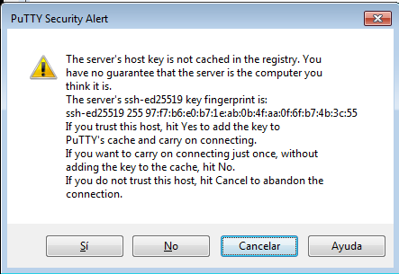

- La siguiente vez que nos conectemos ya no aparecerá ese mensaje.

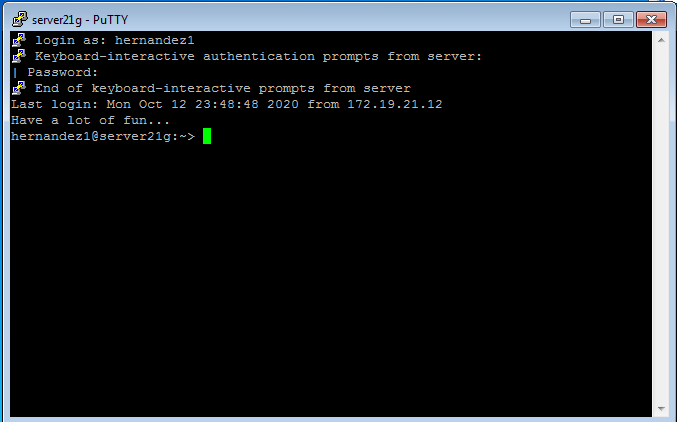

---

## 3.- Cambiamos la identidad del servidor.
- Modificar el fichero `/etc/ssh/sshd_config` para dejar una única línea sin comentar: `HostKey /etc/ssh/ssh_host_rsa_key`.

### 3.1.- Regenerar certificado
- Ir al servidor.
- Ejecutar `ssh-keygen -t rsa -f /etc/ssh/ssh_host_rsa_key` como usuario root.
- Reiniciar el servicio SSH `systemctl restart sshd`.
- Comprobar que el servicio está activo.

### 3.2.- Comprobar.
- Al intentar conectarnos desde los clientes aparece un mensaje de alerta, puesto que, al haber regenerado el certificado del servidor, ssh alerta de un posible ataque `man-in-the-middle`.

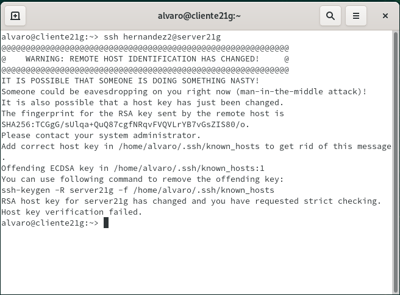

- Para solucionar esto ejecutaremos `ssh-keygen -R server21g -f /home/alvaro/.ssh/known_hosts`

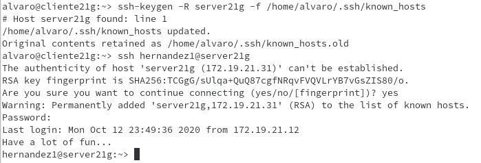

---

## 4.- Personalizar el prompt de Bash.
- Para personalizar el prompt cambiaremos el ficehro `/home/hernandez1/.bashrc` del usuario que queramos cambiar, en este caso cambiaremos el del usuario hernandez1.
- Además, crearemos el fichero `/home/hernandez1/.alias` y crearemos alias, como por ejemplo: `alias v='vdir -cFl'`. De esta manera, no tendremos que escribir el comando completo, solo el alias.
  - Linux:

  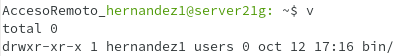
  - Windows:
  
  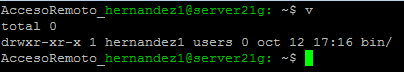

---

## 5.- Autenticación mediante claves públicas.
- Ir a la máquina cliente21g.
- Ejecutar `ssh-keygen -t rsa` para generar un nuevo par de claves.

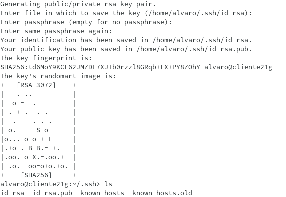
- Copiar la clave pública al `id_rsa.pub` al fichero `authorized_keys` en el usuario remoto hernandez4:

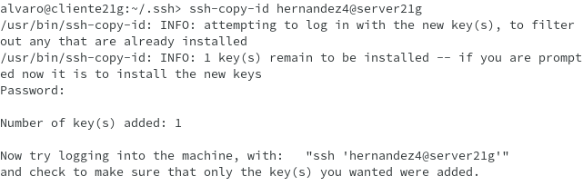
- Comprobar que al acceder via SSH:
  - Desde cliente21g, no pide contraseña
  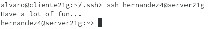
  - Desde cliente21w, sí pide contraseña
  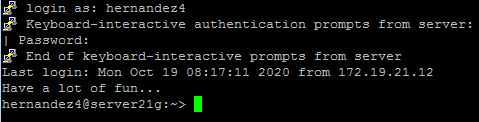

---

## 6.- Uso de SSH como túnel X.
- Instalar una aplicación de entorno gráfico en el servidor. En este caso instalaremos geany.

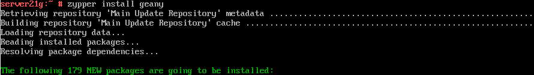

- Modificar la opción `X11Forwarding yes` en el fichero `/etc/ssh/sshd_config`.

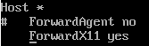

- Comprobar que la aplicación no está instalada en la máquina cliente con `zypper se geany`.

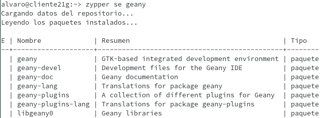

- Conectar al servidor por ssh con el parámetro -X: `ssh -X hernandez1@server21g`, y ejecutar el programa.

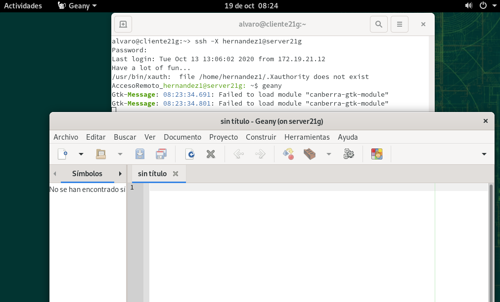

---

## 7.- Aplicaciones Windows nativas.
Utilizaremos el emulador WINE para ejecutar aplicaciones nativas de Windows mediante ssh.
- Instalar emulador Wine en server21g.
- Instalar el programa nativo de Windows mediante Wine, en este caso será notepad++.

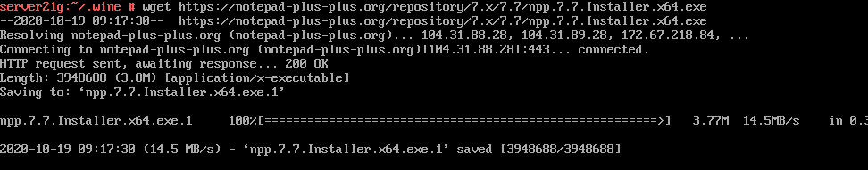
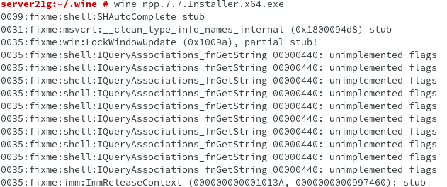

- Comprobar el funcionamiento de notepad++ en cliente21g.

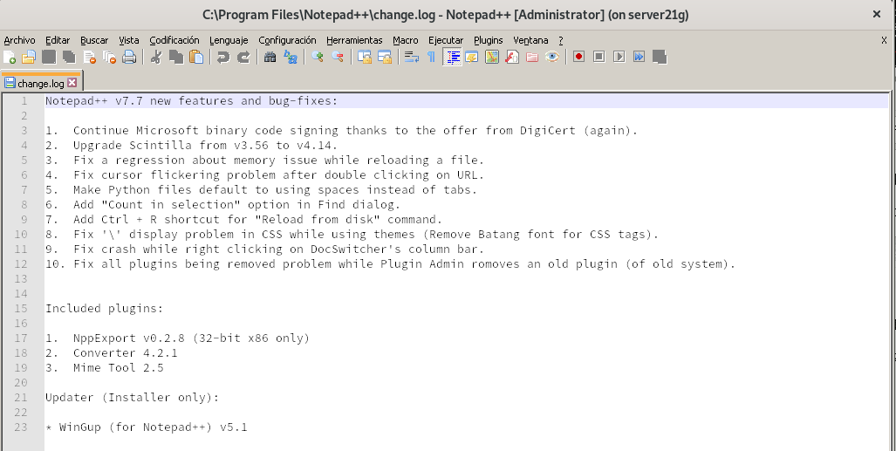

---

## 8.- Restricciones de uso
### 8.1.- Restricción subre un usuario.
- Modificar el fichero `/etc/ssh/sshd_config`, añadir la opción `DenyUser hernandez2`. 

- Comprobar si la sintaxis del fichero es correcta (0 => OK, 1 => ERROR)

- Comprobar la restricción del usuario.

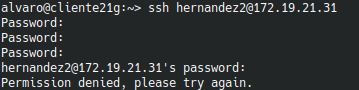

### 8.2.- Restricción sobre una aplicación.
- Crear el grupo `remoteapps`.
- Incluir `hernandez4` en el grupo `remoteapps`.
- Cambiar los permisos de geany a 750 y asignarle el grupo `remoteapps`.

- Comprobar el funcionamiento desde el usuario `hernandez1`.

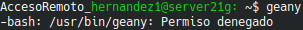
- Comprobar el funcionamiento desde el usuario `hernandez4`.

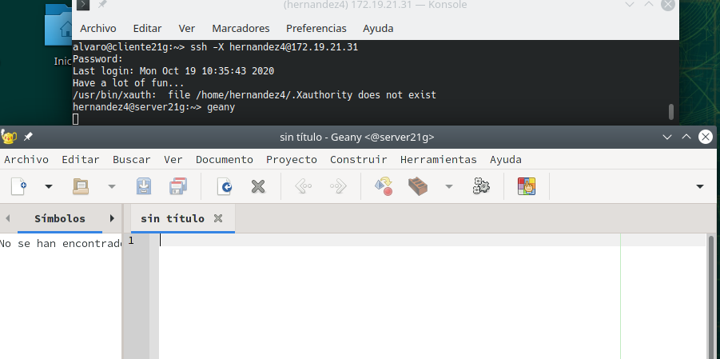