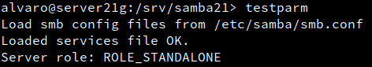
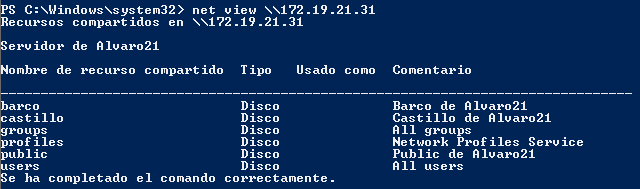
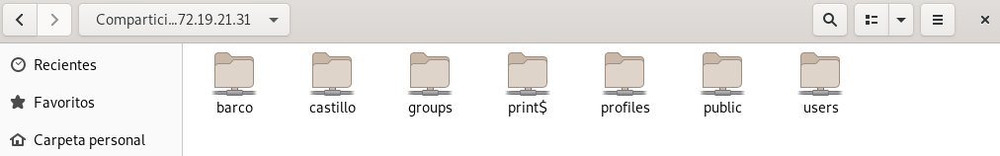
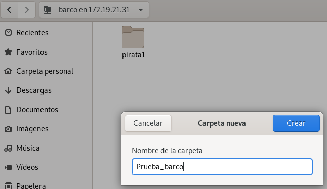

## Unidad 2 - Actividad 1
# Recursos compartidos SMB-CIFS
## 1 Servidor samba
### 1.1 Preparativos
- Lo primero será crear un servidor GNU/Linux y configurarlo.
- El nombre del servidor será `server21g`.
- Añadir en el fichero `/etc/host` los equipos `cliente21g` y `cliente21w` con su IP correspondiente.

### 1.2 Usuarios locales
- Crear los grupos `piratas`, `soldados` y `sambausers`.
- Dentro del grupo `piratas`, incluir a los usuarios `pirata1`, `pirata2` y `supersamba`.
- Dentro del grupo `soldados`, incluir a los usuarios `soldado1`, `soldado2` y `supersamba`.
- Dentro del grupo `sambausers`, incluir a todos los usuarios `soldados`, `piratas`, `supersamba` y `sambaguest`.

### 1.3 Crear las carpetas para recursos compartidos
- Crear las carpetas para recursos compartidos de la siguiente forma:

### 1.4 Configurar servidor Samba
- Abrir `Yast -> Samba Server`:
    - Workgroup: `curso2021`.
    - Sin controlador de dominio.

- En la pestaña `Inicio` definimos:
    - Iniciar durante el arranque.
    - Ajustes de cortafuegos -> Abrir puertos.

- Para comprobar el cortafuegos, ejecutar el comando `nmap -Pn 172.19.21.31` desde otra máquina GNU/Linux. Observamos que los puertos SMB/CIFS (139 y 445) están abiertos.

### 1.5 Crear los recursos compartidos de red
Para configurar los recursos compartidos de red en el servidor lo haremos modificando directamente el fichero de configuración: `/etc/samba/smb.conf`.
- Configurar las secciones `global`, `public`, `barco` y `castillo` de la siguiente manera:

- Ejecutar el comando `testparm` para verificar si la sintaxis del archivo de configuración es correcta.

### 1.6 Usuario Samba
Después de crear los usuarios en el sistema, hay que añadirlos a samba. Para ello tendremos que ejecutar el comando `smbpasswd -a USUARIO` para cada uno de los usuarios que queramos añadir.
Para comprobar la lista de usuarios bastará con ejecutar el comando `pdbedit -L`.

### 1.7 Reiniciar
- Ahora que hemos configurado el servidor samba hay que recargar los ficheros de configuración. Para ello reiniciaremos los servicios `smb` y `nmb`.
- Con el comando `lsof -i` comprobamos que elservicio SMB/CIFS está a la escucha.

---
## 2 Windows
Primero tendremos que configurar nuestra máquina Windows. Usaremos el nombre y la IP que hemos establecido en el fichero `/etc/hosts` del servidor.
Una vez configurada la máquina editaremos el fichero `.../etc/hosts` y le introduciremos el nombre y la IP de nuestro servidor.

### 2.1 Cliente Windows GUI
- Si escribimos `\\172.19.21.31` en el explorador de archivos vemos lo siguiente:

- Al acceder al recurso `public`, no nos pide ningún tipo de identificador pero no nos permite realizar ningún cambio.
- Al intentar entrar al recurso `barco` nos pedirá identificarnos. Si ponemos el usuario `pirata1` nos permitirá entrar.

- Para ver las conexiones abiertas ejecutar el comando `net use`.

- Hacer lo mismo con el recurso compartido `castillo` y el usuario `soldado1`.
- Volver al servidor Samba.
- Ejecutar `smbstatus`:

- Ejecutar `lsof -i`:

### 2.2 Cliente Windows comandos
- Con el comando `net view \\172.19.21.31` vemos los recursos compartidos del servidor remoto.

Vamos a montar el recurso `barco` de forma persistente.
- Ejecutar el siguiente comando:

- Ahora podemos entrar en la unidad S: y crear carpetas:

- Volver al servidor Samba
- Ejecutar `smbstatus`:

- Ejecutar `lsof -i`:

---

## 3 Cliente GNU/Linux
### 3.1 Cliente GNU/Linux GUI
- Entrar al explorador de archivos de Linux, pulsar `CTRL + L` y escribir `smb://172.19.21.31` para ver todos los recursos compartidos.

- Intentar crea una carpeta en `barco`:

- Intentar crea una carpeta en `castillo`:

- Si intentamos crear una carpeta en `public` vemos que no tenemos permiso, pues es de sólo lectura.

- Volver al servidor Samba
- Ejecutar `smbstatus`:

- Ejecutar `lsof -i`:

### 3.2 Cliente GNU/Linux comandos
- Con el comando `smbcliente --list 172.19.21.31` comprobamos los recursos compartidos del servidor remoto.

- Crear la carpeta local `/mnt/remoto21/castillo`.

- Montamos el recurso compartido en la carpeta que acabamos de crear con el comando `mount -t cifs //172.19.21.31/castillo /mnt/remoto21/castillo -o username=soldado1` y comprobamos que se ha montado correctamente con el comando `df -hT`.

- Probamos a crear un archivo `soldado1.txt` desde el cliente.

- Al comprobarlo desde el servidor vemos que se ha creado correctamente.

- Ejecutar `smbstatus`:

- Ejecutar `lsof -i`:

### 3.3 Montaje automático
- Al reiniciar la máquina y volver a ejecutar el comando `df -hT` vemos que el recurso castillo ya no está montado.

- Para que el montaje sea permanente tendremos que configurar el fichero `/etc/fstab` añadiendo la línea `//172.19.21.31 castillo /mnt/remoto21/castillo cifs username=soldado1,password=soldado1 0 0`.

- Si reiniciamos la máquina y volvemos a ejecutar el comando `df -hT` vemos que ahora sí se queda grabada la configuración.

