## Unidad 3 - Actividad 1
# Servidor de impresión en Windows
## 1. Impresora compartida
### 1.1 Rol impresión
- En el servidor, instalar rol/función de servicios de impresión.

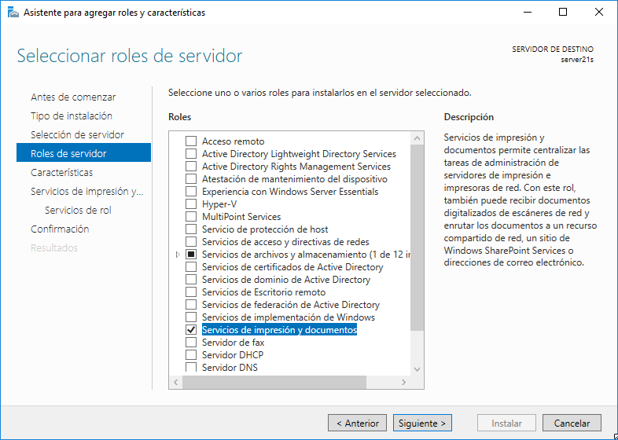

- Incluir Impresión en Internet.

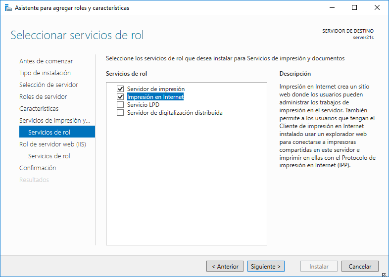

### 1.2 Instalar impresora PDF
- Descargar la herramienta `PDFCreator`.

- Configurar en `Perfiles -> Guardar`.

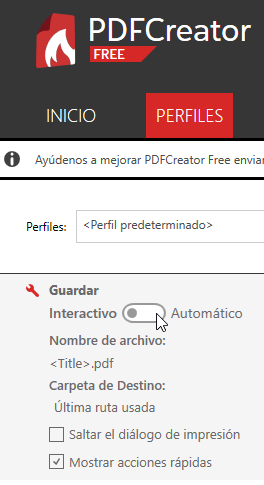

- Configurar el guardado automático e indicar la carpeta de destino.

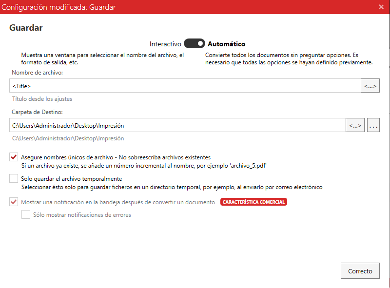

### 1.3 Probar impresión en local
- Para probar la impresión local crearemos un archivo `imprimir21s-local`.

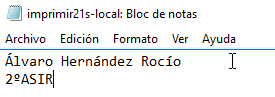

- Imprimir el documento seleccionando `PDFCreator` como impresora.

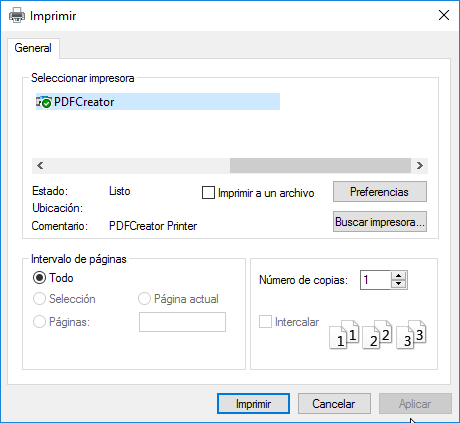

- Vemos que aparece el archivo pdf en la carpeta de destino que indicamos anteriormente.

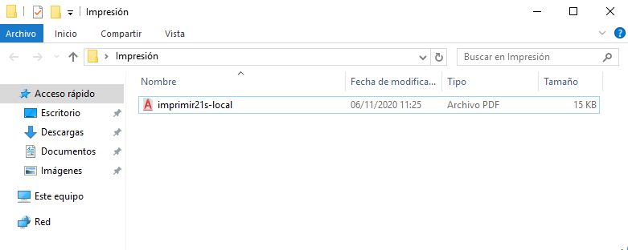

---
## 2. Compartir por red
### 2.1 En el servidor
- Ir a `Administrador de impresión -> Impresoras -> PDFCreator -> Compartir` y cambiar el nombre del recurso compartido por `PDFalvaro21`. 

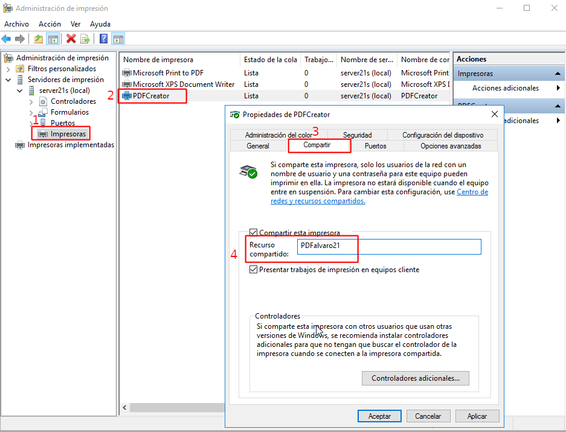

### 2.2 Comprobar desde el cliente
- Buscar recursos de red en el servidor con `\\172.19.21.11` en la barra de navegación.

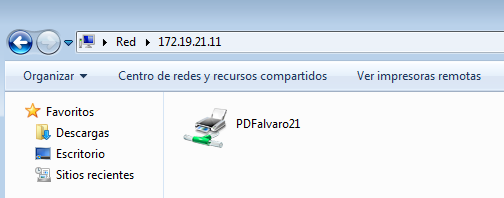

- Seleccionar la impresora y pulsar la opción `Conectar`.

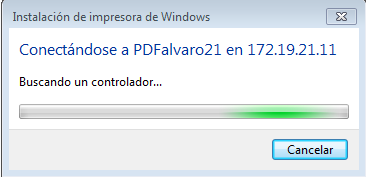

- Para imprimir desde remoto seguimos los mismos pasos que en local. Cremos un documento `imprimir21w-remoto`.

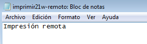

- Le damos a imprimir y seleccionamos la impresora `PDFCreator`.

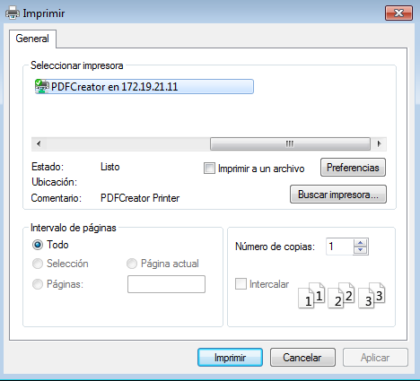

- Si volvemos a la carpeta de destino del servidor, observamos que aparece el nuevo pdf.

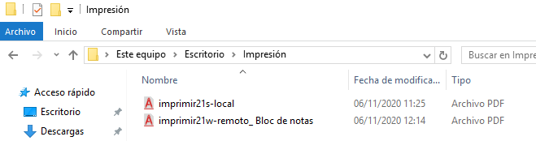

---
## 3. Acceso Web
### 3.1 Instalar característica Impresión WEB
- Vamos al servidor
- Comprobamos que está instalado el servicio `Impresión de Internet`.

### 3.2 Configurar impresión WEB
- Abrir navegador web y poner la URL `http://172.19.21.11/printers`. Aparecerá una ventana para autentificarte como uno de los usuarios habilitados (por ejemplo "Administrador").

- Vemos que nos aparecen todas las impresoras disponibles.

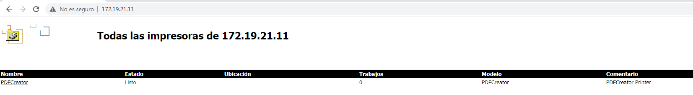

- Entramos en la pestaña `Propiedades` y apuntamos el nombre de la red.

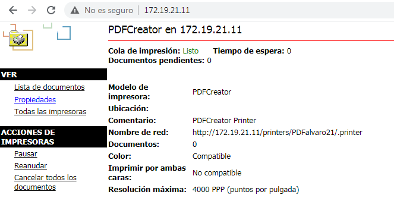

- Agregamos una nueva impresora de red.

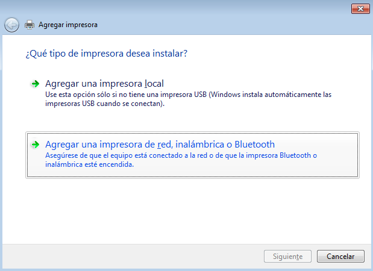

- En la opción `seleccionar una impresora` ponemos el nombre que copiamos en la pestaña de propiedades. 

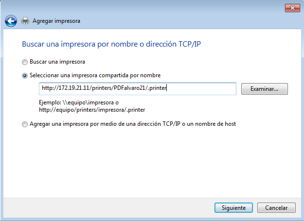

- Indicamos el usuario y la contraseña, usuario Administrador en este caso.

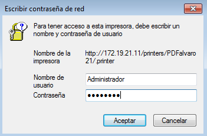

- Y nos saldrá un mensaje indicando que la impresora se agregó correctamente.

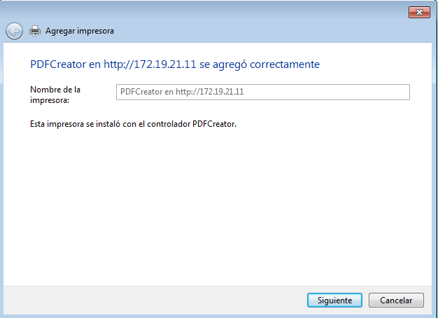

### 3.3 Comprobar desde el navegador
- Para probar desde el navegador vamos a empezar por poner la impresora en pausa desde el servidor.

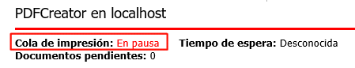

- Entonces crearemos un archivo `imprimir21w-Web`, le damos a imprimir y seleccionamos la impresora en `http://172.19.21.11`.

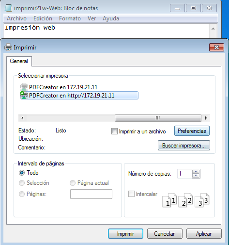

- Al estar la impresora en pausa nos aparece el archivo en la cola. Le damos a reanudar.

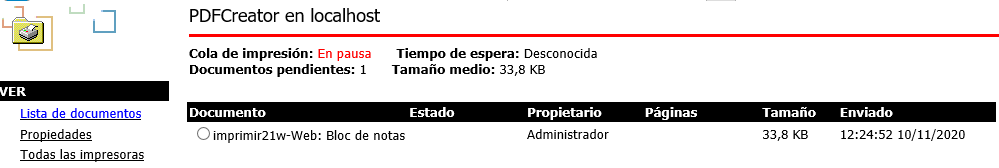

- Y ya nos aparece el archivo pdf en la carpeta destino del servidor.

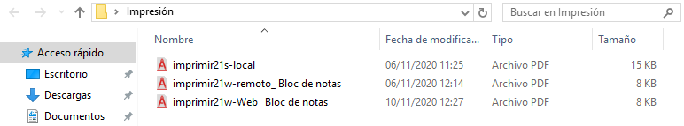