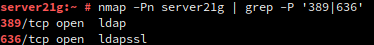

## Unidad 4 - Actividad 1
# Servicio de Directorio con Comandos
## 1. Preparativos
### 1.1 Nombre de equipo FQDN
* Nuestra máquina debe tener un FQDN = `server21g.curso2021`.


---

## 2. Instalar el Servidor LDAP
### 2.1 Instalación del paquete
* instalaremos la herramienta con el comando `zypper in 389-ds` y comprobaremos la versión con `rpm -qa | grep 389-ds` (Deberá ser de la serie 1.4.x).


### 2.2 Configurar la instancia
* Crearemos el archivo `/root/instance.inif` y escribiremos la siguiente configuración:


* Ejecuramos el comando `dscreate -v from-file /root/instance.inf` para crear nuestra instancia desde el archivo `instance.inf` y con `dsctl localhost status` comprobaremos su estado.


* Crearemos el fichero de configuración `.dsrc`.


### 2.3 Comprobar el Servicio
* Comprobamos que el servicio está en ejecución con `systemctl status dirsrv@localhost`.


* Comprobamos que los puertos 389 y 636 están abiertos con `namp -Pn server21g | grep -P '389|636'`.



### 2.4 Comprobar el acceso al contenido de LDAP
* Comprobar, con el comando `ldapsearch -b "dc=ldap21,dc=curso2021" -x | grep dn`, que existen las OU Groups y People.


* También podemos hacer la consulta usando el usuario/clave con `ldapsearch -H ldap://localhost -b "dc=ldap21,dc=curso2021" -W -D "cn=Directory Manager" | grep dn`.


---

## 3. Añadir usuarios LDAP por comandos
### 3.1 Buscar Unidades Organizativas
* LDAP nos permite filtrar. Un ejemplo es:


### 3.2 Agregar usuarios
* Creamos el archivo `mazinger-add.ldif` con la configuración de creación del usuario `mazinger`


* Escribimos los datos del fichero en LDAP con `ldapadd -x -W -D "cn=Directory Manager" -f mazinger-add.ldif `


### 3.3 Comprobar el nuevo ususario
* Ejecutamos el comando `ldapsearch -W -D "cn=Directory Manager" -b "dc=ldapXX,dc=curso2021" "(uid=*)"` para comprobar que se ha creado el usuario correctamente.


---
## 4. Contraseñas encriptadas
### 4.1 Herramienta slappasswd
* Ejecutar `zypper in openldap2` para instalar la herramienta `slappaswd`.
* Con el atributo `-h` podemos elegir uno de los siguientes esquemas para almacenar la contraseña:

```
    {CLEARTEXT} (texto plano),
    {CRYPT} (crypt),
    {MD5} (md5sum),
    {SMD5} (MD5 con salt),
    {SHA} (1ssl sha) y
    {SSHA} (SHA-1 con salt, esquema por defecto).
```

### 4.2 Agregar usuarios con clave encriptadas
Usuario Koji Kabuto:
- Primero generamos la clave.


- Copiamos la clave generada, creamos el archivo `koji-add.ldif` con los datos necesarios y en el valor `userPassword` ingresamos la clave generada.


- Escribimos los datos del fichero en LDAP.


Repetiremos estos mismos pasos para los usuarios `Boss` y `Doctor Infierno`.

### 4.3 Comprobar los usuarios creados
* Para permitir el acceso remoto al servicio LDAP añadiremos los servicios `ldap` y `ldaps` del cortafuegos.


* Vamos a la máquina cliente y ejecutamos el comando `nmap -Pn 172.19.21.31` para comprobar los puertos que están abierto. Como vemos, los puertos `389` y `636` corresponden al servicio LDAP.


* Por último, consultamos los usuarios LDAP con el comando `ldapsearch -H ldap://172.19.21.31 -W -D "cn=Directory Manager" -b "dc=ldap21,dc=curso2021" "(uid=*)" | grep dn`.


