## Unidad 4 - Actividad 2
# Cliente para autenticación LDAP
## 1. Preparativos
Antes de empezar vamos a comprobar el acceso al servidor LDAP desde el cliente:
* Para ver si los puertos de LDAP están abiertos y son accesibles desde el cliente, ejecutaremos el comando `nmap -Pn server21g | grep -P '389|636'`.

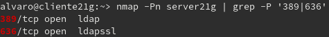

* Con `ldapsearch -H ldap://server21g:389 -W -D "cn=Directory Manager" -b "dc=ldap21,dc=curso2021" "(uid=*)" | grep dn` podemos ver los usuarios de LDAP son visibles desde el cliente.

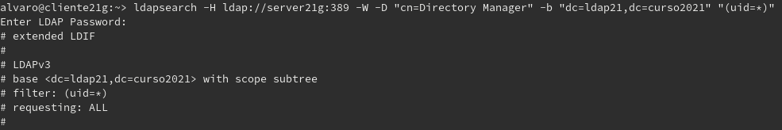

* Vemos que aparecen varios usuarios como `mazinger`,

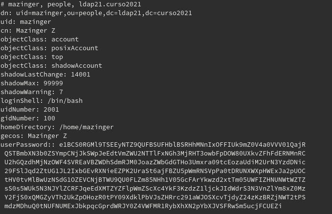

* O `koji`.

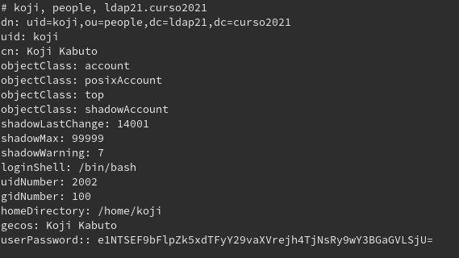

---
## 2. Crear autenticación LDAP
### 2.1 Crear conexión con el Servidor
* Vamos a `Yast -> Cliente LDAP y Kerberos`.
* Comprobamos que el nombre del equipo es correcto.

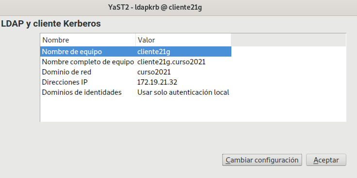

* Le damos a `Cambiar configuración` y lo configuramos de la siguiente manera:

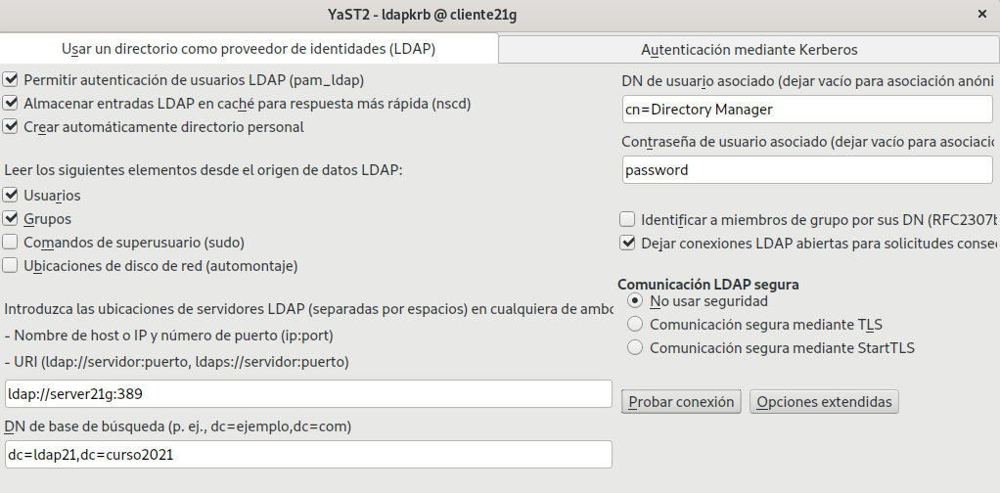

* Probamos la conexión y vemos que entra correctamente

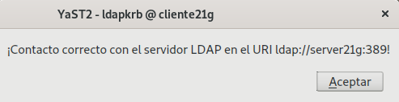

### 2.2 Comprobar con Comandos
Vamos a la consola con usuario root y ejecutamos lo siguiente:
* Con `id mazinger` vemos la configuración del usuario `mazinger`
* Para poder utilizar el usuario haremos `su -l mazinger`, con el atributo `-l` no nos pedirá la contraseña y, al ser la primera vez que entramos al usuario, creará el directorio home del usuario.

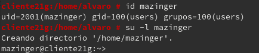

* `gatent passwd mazinger` muestra más información del usuario.
* Con `cat /etc/passwd | grep mazinger` no nos aparece nada porque no es un usuario local.

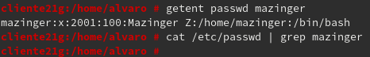

---

## 3. Crear usuarios y grupos dentro de LDAP
* Iremos a `Yast -> Gestión de usuarios y grupos`. En la pestaña `Definir filtro` encontraremos la opción `LDAP users`, que nos pedirá el usuario LDAP y la contraseña.

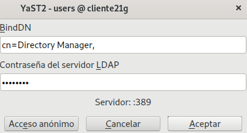

* *NOTA:En este paso aparece el siguiente error y no nos permite continuar:*

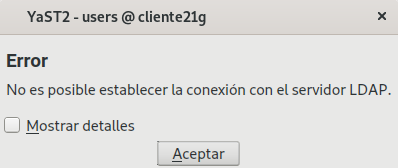
