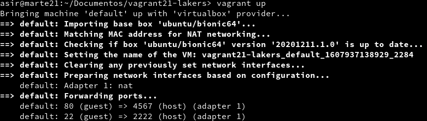

## Unidad 5 - Actividad 1
# Vagrant con VirtualBox
```
1. Introducción
2. Instalar Vagrant
3. Proyecto Celtics
    3.1 Imagen, caja o box
    3.2 Directorio
    3.3 Comprobar
4. Teoría
5. Proyecto Hawks
    5.1 Crear proyecto Hawks
    5.2 Comprobar
6. Suministro
    6.1 Proyecto Lakers (Suministro mediante shell script)
    6.2 Proyecto Raptors (Suministro mediante Puppet)
7. Proyecto Bulls (Nuestra caja)
    7.1 Preparar MV VirtualBox
    7.2 Crear caja Vagrant
    7.3 Usar la nueva caja
```

## 1. Introducción
Vagrant es una herramienta para la creación
y configuración de entornos de desarrollo virtualizados.

Originalmente se desarrolló para VirtualBox y sistemas de configuración
tales como Chef, Salt y Puppet. Sin embargo desde la versión 1.1 Vagrant es capaz de trabajar con múltiples proveedores, como VMware, Amazon EC2, LXC, DigitalOcean, etc.2

Aunque Vagrant se ha desarrollado en Ruby se puede usar en multitud de
proyectos escritos en otros lenguajes.

---
## 2. Instalar Vagrant
* Instalaremos la herramienta Vagrant. Hay que tener en cuenta que las versiones de Vagrant y VirtualBox deben ser compatibles. En este caso, la versión 6.0.10 de Virtual Box y la 2.2.14 de Vagrant, lo son.


---
## 3. Proyecto Celtics
### 3.1 Imagen, caja o box
* Vamos a descargar una caja a través de Vagrant con `vagrant box add BOXNAME` (En este caso, el nombre de la caja es `ubuntu/bionic64`).


* Para comprobar que se ha descargado correctamente podemos listar todas las cajas con el comando `vagrant box list`.


### 3.2 Directorio
* Para este primer proyecto vamos a crear un directorio llamado `vagrant21-celtics`.


* Dentro del directorio creamos un fichero llamado `Vagrantfile` con el siguiente contenido:


### 3.3 Comprobar
* Dentro del directorio `vagrant21-celtics` y con el fichero `Vagrantfile` creado correctamente ejecutamos el comando `vagrant up` para iniciar una nueva instancia de la máquina.


* Comprobamos que se ha iniciado correctamente entrando mediante SSH utilizando `vagrant ssh`.


---
## 4. Teoría
**Carpetas compartidas**

La carpeta del proyecto que contiene el `Vagrantfile` es visible
para el sistema el virtualizado, esto nos permite compartir archivos fácilmente entre los dos entornos.

Ejemplos para configurar las carpetas compartidas:
* `config.vm.synced_folder ".", "/vagrant"`: La carpeta del proyecto es accesible desde /vagrant de la MV.
* `config.vm.synced_folder "html", "/var/www/html"`. La carpeta htdocs del proyecto es accesible desde /var/www/html de la MV.

**Redireccionamiento de los puertos**

Cuando trabajamos con máquinas virtuales, es frecuente usarlas para proyectos enfocados a la web, y para acceder a las páginas es necesario configurar el enrutamiento de puertos.

* `config.vm.network "private_network", ip: "192.168.33.10"`: Ejemplo para configurar la red.

**Conexión SSH**: Ejemplo para personalizar la conexión SSH a nuestra máquina virtual:

```
config.ssh.username = 'root'
config.ssh.password = 'vagrant'
config.ssh.insert_key = 'true'
```

Ejemplo para configurar la ejecución remota de aplicaciones gráficas instaladas en la máquina virtual, mediante SSH:
```
config.ssh.forward_agent = true
config.ssh.forward_x11 = true
```

---
## 5. Proyecto Hawks
En este proyecto vamos a utilizar el redireccionamiento de puertos.
### 5.1 Crear proyecto Hawks
* Creamos la carpeta `vagrant21-hawks`, y el archivo `Vagrantfile` de la siguiente manera:


> De este modo, el puerto 4567 del sistema anfitrión será enrutado al puerto 80 del ambiente virtualizado. 

* Ejecutamos el comando `vagrant up` para iniciar una nueva instancia de la máquina (podemos ver como cambian los puertos por defecto), y entramos mediante ssh.


* Por último, instalamos `apache2`.


### 5.2 Comprobar
* En la máquina real comprobamos que el puerto 4567 está a la escucha con `vagrant port`.


* Abrimos un navegador desde el host con el URL `127.0.0.1:4567` y vemos que nos lleva a la página por defecto de Apache2.


---
## 6. Suministro
* Antes de empezar un nuevo proyecto es aconsejable destruir con los que ya hemos acabado. Para ello ejecutaremos `vagrant destroy` dentro del directorio del proyecto.


### 6.1 Proyecto Lakers (Suministro mediante shell script)
* Creaos el directorio `vagrant21-lakers` con una carpeta llamada `html` y, dentro de esta, el fichero `index.html` que tendrá una página básica de html.


* Vamos a crear el scrpit `install_apache.sh` con el siguiente contenido:


* Finalmente, creamos el archivo `Vagrantfile` añadiendo un parámetro que nos permitirá ejecutar el script anterior.


* `vagrant up` para crear la máquina virtual.



* Vemos que, durante la creación de la máquina, muestra mensajes de la instalación de Apache2.


* Para verificar que el servidor apache ha sido instalado y está utilizando nuestro `index.html` vamos a abrir un navegador en la máquina real con el URL `127.0.0.1:4567`.


* Al terminar, destruimos la máquina.


### 6.3 Proyecto Raptors (Suministro mediante Puppet)
* Vamos a crear el directorio `vagrant21-raptors` con el siguiente archivo `Vagrantfile`.


* Creamos una carpeta `manifests` y un archivo en su interior llamado `alvaro21.pp` con el siguiente contenido:


> Con este archivo se instalará la herramienta `geany` durante la creación de la máquina.

* Creamos la máquina con `vagrant-up`.


* Entramos con ssh y comprobamos que la herramienta `geany` está instalada.


---
## 7. Proyecto Bulls (Nuestra caja)
### 7.1 Preparar la MV VirtualBox
**Elegir la máquina virtual**
* Para este proyecto vamos a crear una nueva máquina virtual o a usar una que ya tengamos. En este caso usaremos una ya creada.
* Primero tendremos que configurar la red en modo dinámico (DHCP).


* Instalaremos OpenSSH, en este caso lo había instalado anteriormente así que comprobamos con `ssh -V`.


**Crear usuario con acceso SSH**

* Crear el usuario vagrant.


* Le cambiaremos la contraseña al usuario root por "vagrant".


* Le ponemos la misma contraseña al usuario vagrant.


* Creamos la carpeta de configuración SSH


* Descargamos la clave pública.


* Modificamos los permisos de la carpeta.


* Modificamos el propietario de la carpeta.


**Sudoers**

* Añadir `vagrant ALL=(ALL) NOPASSWD: ALL` al fichero de configuración `/etc/sudoers`.


**Añadir las VirtualBox Guest Additions**

* Las `VirutalBox Guest Additions` deben ser compatibles con el host anfitrión. Comprobamos


> *NOTA: Al ejecutar este comando nos debería aparecer la versión de las VirtualBox Guest Additions instalada, pero no es mi caso. Si esto ocurre nos dará problemas a la hora de crear la Máquina virtual.*

### 7.2 Crear caja Vagrant

* Vamos a crear una nueva carpeta `vagrant21-bulls` para el nuevo proyecto.
* Con `VBoxManage list vms` vemos todas nuestras máquinas creadas. En este caso vamos a elegir la llamada `ADD_Cliente21g2`.


* Con la máquina apagada, ejecutamos `vagrant package --base VMNAME --output nombre-alumnoXX.box` para crear nuestra caja.


* Comprobamos que se haya creado el archivo `alvaro21.box`


* Añadimos nuestra caja al repositorio local de cajas Vagrant


* Vemos que aparece dispnible nuestra caja.


* Creamos un nuevo `Vagrantfile` para nuestra caja


* Levantamos una nueva Máquina virtual.


>*Nota: Aquí es dónde nos aparecerá el error debido al fallo en la instalación de las VirtualBox Guest Additions.*