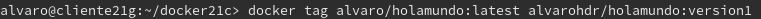

## Unidad 5 - Actividad 2
# Docker
## 1. Contenedores con Docker
### 1.1 Instalación
* Para instalar docker en OpenSUSE, ejecutar el comando `zypper in docker`.

* Iniciamos el servicio con el comando `systemctl start docker`. Y, si además queremos que el servicio se inicie automáticamente al encender la máquina ejecutamos `systemctl enable docker`.

* Añadimos nuestro usuario al grupo `docker`.

* Comprobamos que con `docker version` se muestra la información del cliente y del servidor.

### 1.2 Habilitar el acceso a la red externa a los contenedores
* Para habilitar el acceso a la red externa, el estado de IP_FORWARD debe estar en 1 (activado). En este caso aparece activado por defecto.

### 1.3 Primera prueba
* El comando `docker run hello-world` descarga una imagen *hello-world*, crea un contenedor, y ejecuta la aplicación que hay dentro. Al ejecutarlo, nos dice "*Unable to find image 'hello-world:lastest' locally*", por lo que descargará la imagen de internet.

* Comprobamos que se ha descargado la imagen correctamente.

* Ejecutando `docker ps -a` nos aparecen los contenedores que tenemos creados. Vemos que se ha creado uno desde la imagen `hello world`.

* Con `docker stop ID-CONTENEDOR` paramos el contenedor, y con `docker rm ID-CONTENEDOR` lo eliminamos.

### 1.4 Alias
* Podemos crear una serie de alias para ayudarnos a trabajar de forma más rápida. Para ello crearemos el fichero `/home/alvaro/.alias`.

* Al que le añadiremos el siguiente contenido:

* Reiniciamos la máquina para que se guarden los cambios y probamos su funcionamiento. Por ejemplo, si ejecutamos el comando `di` nos listará las imágenes que tengamos descargadas.

---
## 2. Creación manual de nuestra imagen
### 2.1 Crear un contenedor manualmente
**Descargar una imagen**
* Podemos listar todas las imágenes del repositorio a partir de una etiquete, por ejemplo, listamos las imágenes que tengan la etiqueta `debian`.

* Descargamos la imagen en local.

* Y comprobamos:

**Crear un contenedor**
* El contenedor se llamará `app1debian`, se creará a partir de la imagen `debian`, y se ejecutará el comando `/bin/bash`.

### 2.2 Personalizar el contenedor
**Instalar aplicaciones dentro del contenedor**
* Comprobamos con `cat /etc/motd` que estamos en Debian.

* Actualizamos los repositorios.

* Instalamos nginx en el contenedor

* Instalamos el editor de texto vi.

**Crear un fichero html**
* Creamos un fichero html con el párrafo `Hola Alvaro`.

**Crear un script**
* Creamos el fichero `server.sh` en la ruta `/root` con el siguiente contenido:

>*Recordar que hay que darle permisos de ejecución al script*
>
>

### 2.3 Crear una imagen a partir del contenedor
* Vamos a ejecutar el comando `docker commit app1debian alvaro/nginx1` desde otra ventana de terminal para crear la imagen a partir del contenedor.

* Comproamos que se ha creado la nueva imagen.

* Ejecutando `docker stop app1debian` paramos el contenedor, y lo destruimos con `docjer rm app1debian`. Comprobamos que no aparece el contenedor.

---

## 3. Crear un contenedor a partir de nuestra imagen
### 3.1 Crear contenedor con Nginx
* Vamos a iniciar un contenedor a partir de la imagen con Nginx que acabamos de crear.

### 3.2 Comprobamos
* Con el comando `docker ps` vemos los contenedores en ejecución. Vemos que aparece una columna `PORT` que nos indica que el puerto 80 está redireccionado al puerto local 32768.

* Abrimos un navegador web y buscamos la URL `localhost:32768`, de esta forma nos conectaremos al servidor Nginx que está en ejecución.

* Tamién podemos comprobar el acceso a `holamundo1.html`

* Finalmente paramos y eliminamos el contenedor.

### 3.3 Migrar la imagen a otra máquina
**Exportar la imagen**

* Para exportar la imagen ejecutamos el comando `docker save -o alvaro21docker.tar alvaro/nginx1`, de esta manera, la imagen se guarda en un fichero tar.

**Importar la imagen**

* Copiamos la imagen en otra máquina, en este caso usaremos la herramienta `scp`.

* Comprobamos que se ha copiado correctamente.

* Creamos la imagen a partir del fichero tar usando el parámetro `load`.

* Comprobamos que la imagen se creó correctamente.

* Finalmente, iniciamos un contenedor para comprobar su funcionamiento.

---

## 4. Dockerfile
### 4.1 Preparar ficheros
* Creamos el directorio `docker21a`, y un fichero `holamundo2.html` con el siguiente contenido:

* Creamos el fichero `Dockerfile` con el siguiente contenido:

### 4.2 Crear imagen a partir del Dockerfile
* Para construir una imagen a partir de un Dockerfile basta con situarse en el directorio donde se encuentra el archivo y ejecutar `docker build -t alvaro/nginx2 .`.

* Comprobamos que se ha creado la imagen.

### 4.3 Crear contenedor y comprobar
* Ejecutamos `docker run --name=app4nginx2 -p 8082:80 -t alvaro/nginx2` y comprobamos que se ha iniciado correctamente.

* Desde el navegador comprobamos con la URL `http://localhost:8082`

* Y comprobamos el fichero `holamundo2.html` con la URL `http://:localhost:8082`.

### 4.4 Usar imágenes ya creadas
* Vamos a crear el directorio `docker21b`, y un fichero llamado `holamundo3.html` con el siguiente contenido:

* Creamos el siguiente Dockerfile:

* Creamos la imagen a partir del Dockerfile.

* Iniciamos el contenedor con la imagen creada.

* Finalmente, comprobamos el acceso a `holamundo3.html`.

---

## 5. Docker Hub
* Para este apartado vamos a crear una carpeta con el nombre `docker21c`. En ella crearemos un script (`holamundo21.sh`) con el siguiente contenido:

* Creamos el fichero Dockerfile con lo siguiente:

* Creamos la imagen a partir del fichero Dockerfile.

* Iniciamos un contenedor a partir de la imagen.

* Vamos a registrarnos en la página oficialde Docker Hub. Una vez registrados, ejecutamos `docker login -u USERNAME` (en mi caso, el nombre de usuario es `alvarohdr`), y ponemos la contraseña. 

* Etiquetamos la imagen con `version1`.

* Por último, subimos la imagen a los repositorios de Docker.

