## Unidad 5 - Actividad 3
# Salt-Stack
## 1. Preparartivos
* Para esta actividad utilizaremos las siguientes máquinas virtuales:

| ID  | SSOO     | IP estática   | Equipo       |
| --- | -------- | ------------- | ------------ |
| MV1 | OpenSUSE | 172.19.21.31  | master21g    |
| MV2 | OpenSUSE | 172.19.21.32  | minion21g    |
* Comprobamos la IP del Maestro:

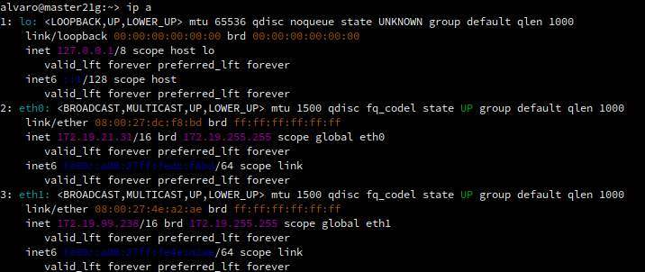
* Comprobamos el nombre de la máquina Maestro:

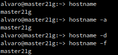
* Comprobamos la IP del Minion:

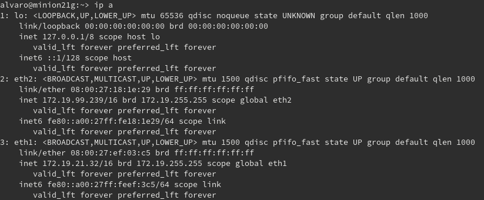
* Comprobamos el nombre de la máquina Minion:

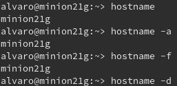

---
## 2. Master: Instalar y configurar
* Instalamos la herramienta `salt-master`.

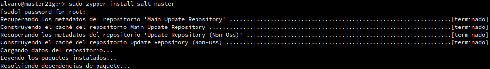
* Añadimos las siguientes líneas al fichero `/etc/salt/master`:

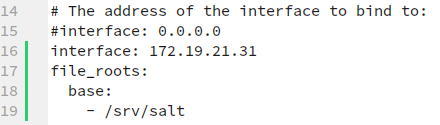
* Activamos el servicio en el arranque del sistema con `systemctl enable salt-master.service`, e iniciamos el servicio con `systemctl start salt-master.service`.

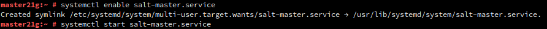
* Para consultar los minions aceptados por nuestro master utilizamos `salt-key -L`. Podemos observar que aún no hay ninguno.

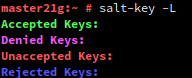

---

## 3. Minion
### 3.1 Instalación y configuración
* Instalamos el software del minion.

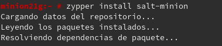
* Añadimos la línea `master:172.19.21.31` al fichero `/etc/salt/minion`.

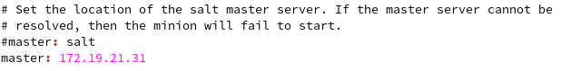
* Activamos el servicio en el arranque del sistema e iniciamos el servicio.

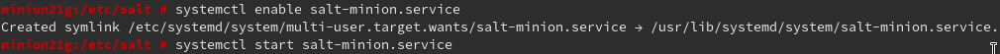
* comprobamos que no está instalado `apache2` en el Minion.

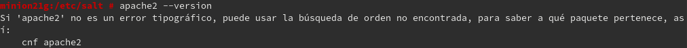

### 3.2 Cortafuegos
* Desde la máquina Master consultamos la zona de red.

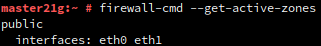
* Abrimos el puerto de forma permanente en la zona "public".

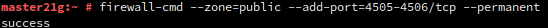
* Reiniciamos el cortafuegos para que se actualicen los cambios.

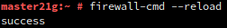
* Comprobamos la configuración de la zona public.

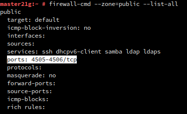

### 3.3 Aceptación desde el Master
* Si ahora ejecutamos `salt-key -L` vemos que el Master recibe la petición del Minion.

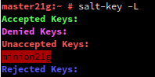
* Acemptamos al Minion y Comprobamos.

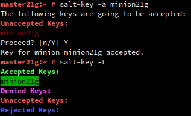

### 3.4 Comprobamos conectividad
* `salt '*' test.ping` para comprobar conectividad y `salt '*' test.version` para comprobar la versión de Salt instalada en el Minion.

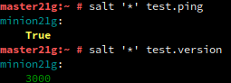

---

## 4. Salt States
### 4.1 Preparar el directorio para los estados
* Crear los directorios `/srv/salt/base` y `/srv/salt/devel`.

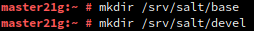
* Crear el archivo `/etc/salt/master.d/roots.conf` con el siguiente contenido:

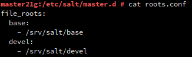
* Reiniciamos el servicio.

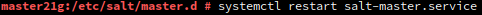

### 4.2 Crear un nuevo estado
* Creamos el fichero `/srv/salt/base/apache/init.sls` con el siguiente contenido:

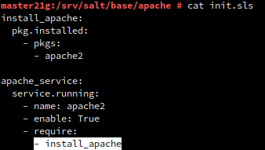

### 4.3 Asociar Minions a estados
* Crear el fichero `/srv/salt/base/top.sls` donde asociaremos el estado que acabamos de crear a nuestro minion.

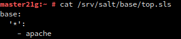

### 4.4 Comprobar: estados definidos
* Consultamos los estados que tenemos definidos para cada minion.

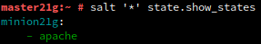

### 4.5 Aplicar el nuevo estado
**En el Master:**
* Consultamos los estados en detalle para verificar que no hay errores en las definiciones:

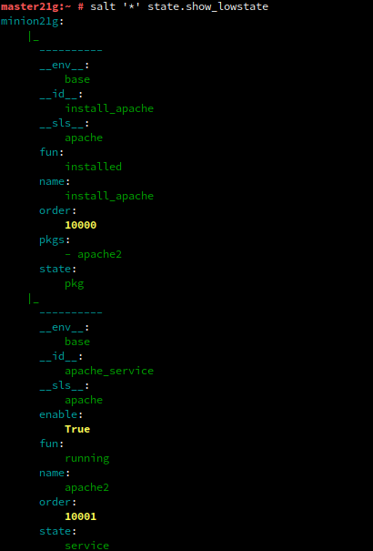

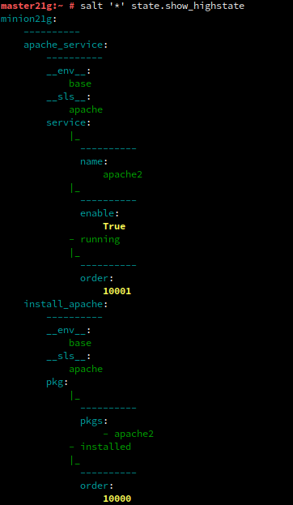
* Aplicamos el nuevo estado en todos los Minions.

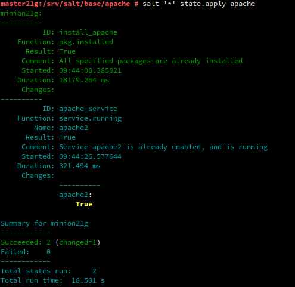
* Comprobamos que se ha instalado e iniciado el servicio `Apache2`.

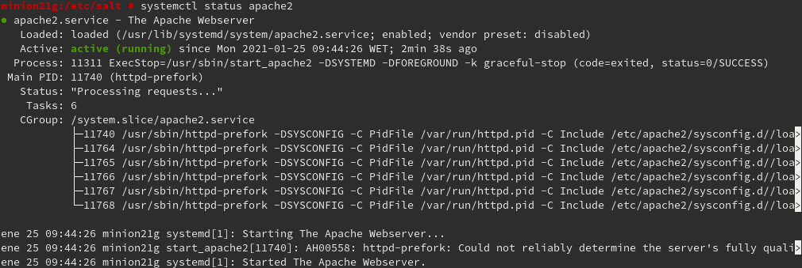

---

## 5. Crear más estados
### 5.1 Crear estado "users"
* Creamos el directorio `/srv/salt/base/users`, y el archivo `init.sls` con el siguiente contenido.

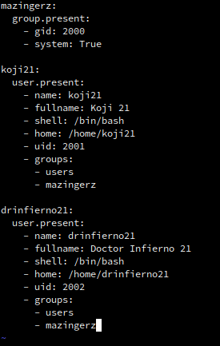
* Aplicamos el estado.

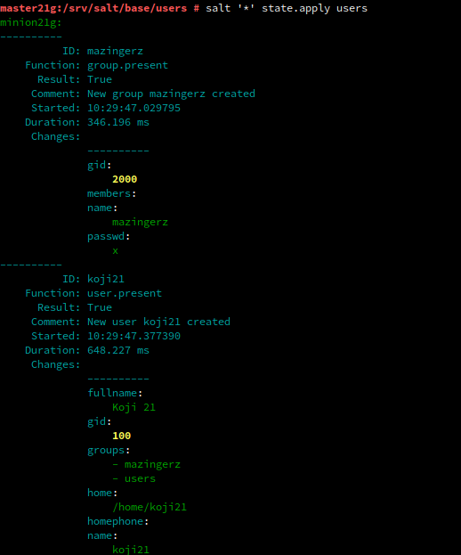
* Comprobamos que se ha creado el grupo y los usuarios en el Minion.

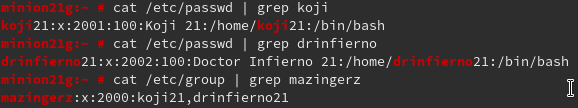

### 5.2 Crear estado "archivos"
* Creamos el estado `archivos`. Dentro del estado, crearemos el archivo `init.sls` con el siguiente contenido:

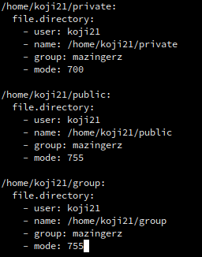
* Aplicamos el estado.

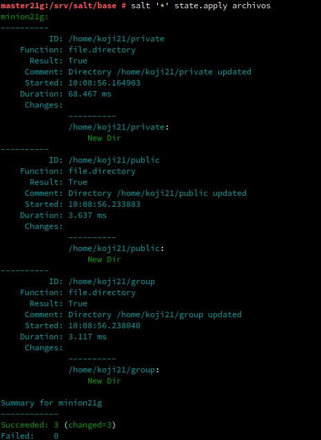
* Comprobamos que se han creado los directorios con los permisos deseados en el Minion.

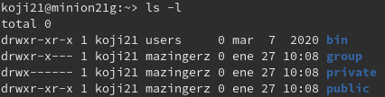

### 5.3 Ampliar estado "apache"
* Creamos el fichero `/srv/salt/base/files/holamundo.html`

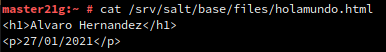
* Incluimos la creación del fichero `holamundo.html` en el estado `apache`.

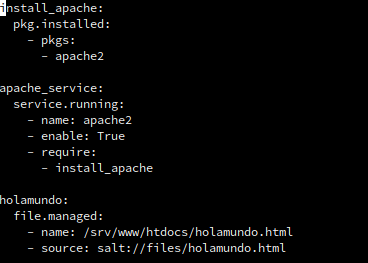
* Aplicamos el estado.

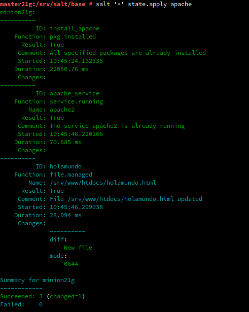
* Comprobamos que se ha creado el archivo `holamundo.html` en el Minion.

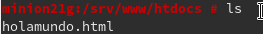
* Finalmente, comprobamos que tenemos acceso al archivo a través de apache.

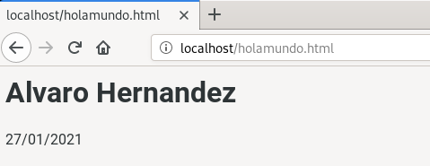