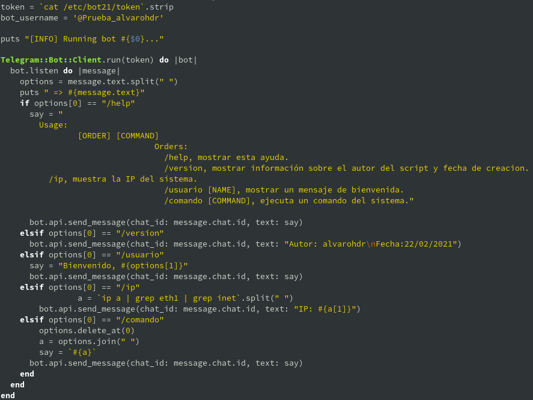
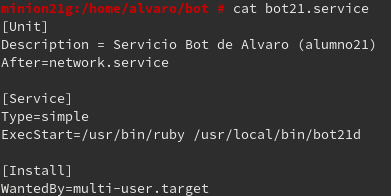
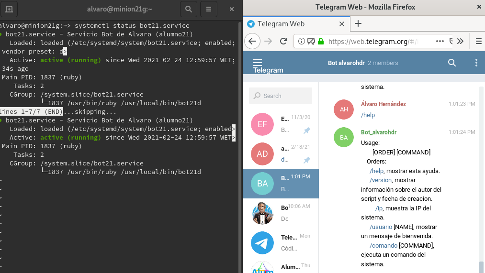
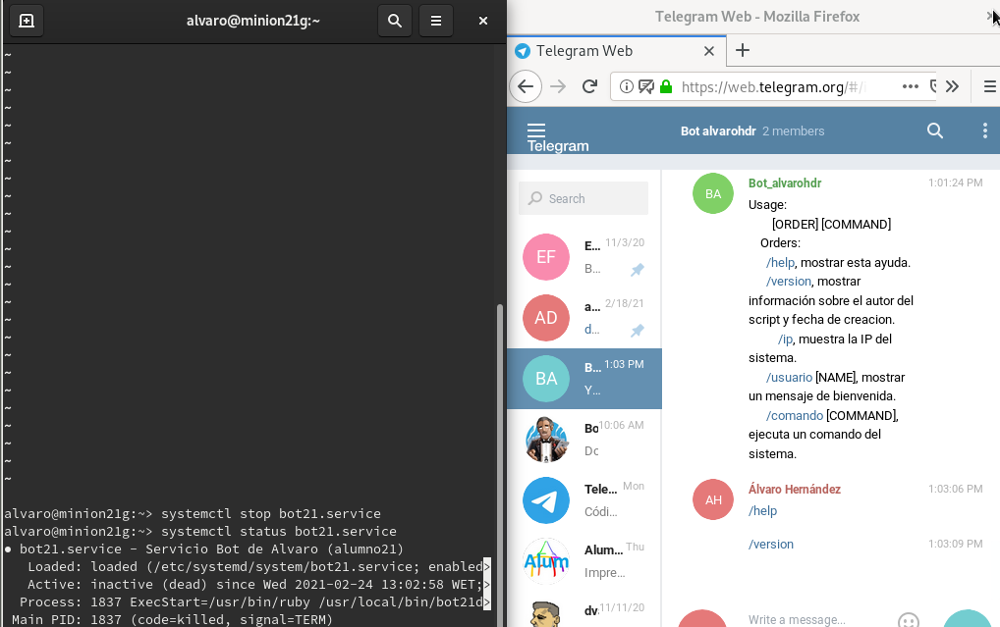
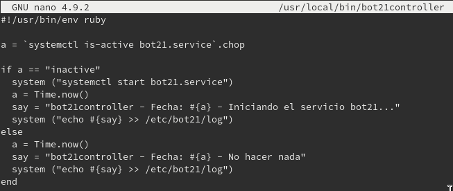
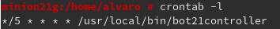
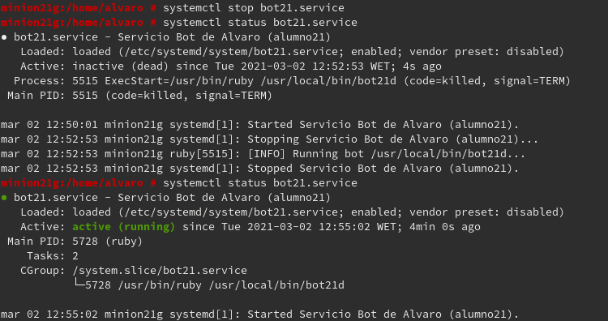
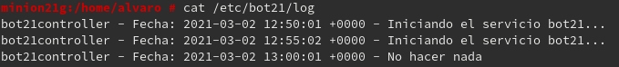

## Unidad 7 - Actividad 2
# Bot-service
## 1. Crear un bot de Telegram con Ruby
* Scrpit del bot:

* Vídeo de YouTube donde se muestra el funcionamiento del bot: https://www.youtube.com/watch?v=LbcQnZ_psfU

---
## 2. Systemd
* Fichero de configuración del servicio:

* Comprobamos que el servicio está activo y el bot está en funcionamiento.

* Paramos el servicio y comprobamos que ahora no funcionan los comandos del bot.

---

## 3. Programar tareas
* Fichero que consulta si el servicio está activo o inactivo. En el caso de estar inactivo, lo inicia. Además, cada vez que se ejecute envía un mensaje al fichero `/etc/bot21/log`.

* Creamos la siguiente tarea con la herramienta crontab:

* Paramos el servicio, esperamos 5 minutos, y vemos que el servicio se activa automáticamente.

* Si observamos el contenido del fichero `cat /etc/bot21/log`, vemos que se ha guardado las acciones realizadas.

